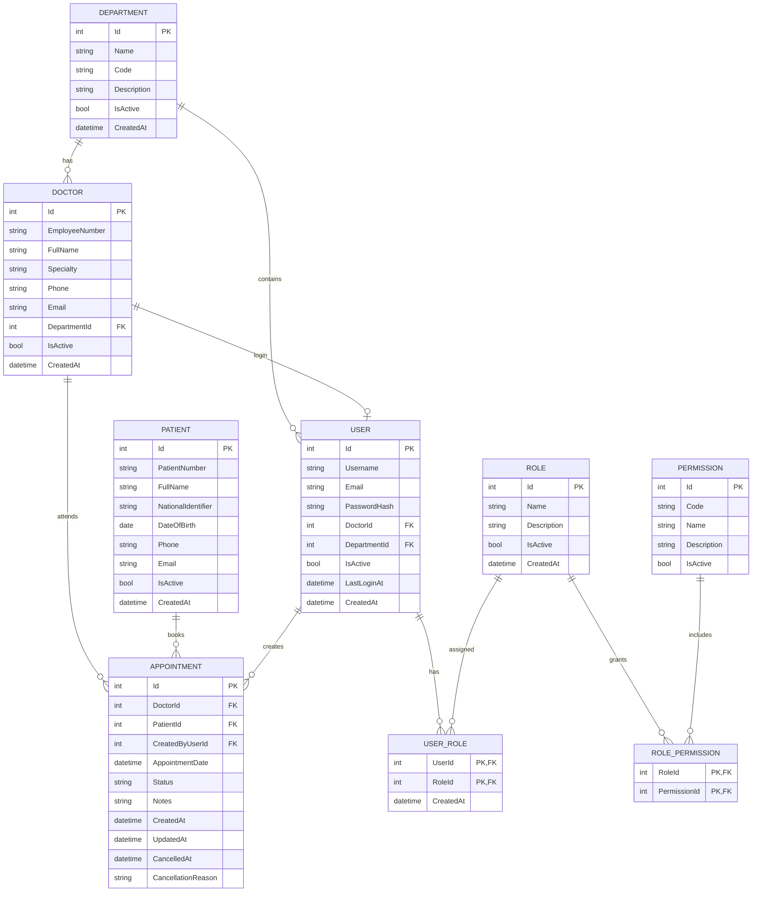

## 1. Add connection string
For security the connection string does not exist in `appsettings.json`.
Add it manually by typing this command in the terminal:
```bash
export ConnectionStrings__DefaultConnection="Host=localhost;Database=medicalboard_db;Username=medicalboard_user;Password="
```

---

## 2. Apply Migrations
To build the migrations files:
```bash
dotnet ef migrations add MedicalBoardMigration --output-dir Migrations
```

To apply migrations to the database:
```bash
dotnet ef database update
```

---

## The ERD



## Files Written By Me:
Data/ApplicationContext.cs    
Data/Configurations/*.cs    
Enums/*.cs    
Models/*.cs    
Program.cs    
README.md

---

- you can verify the schema by `psql` CLI tool or by opening the database with `pgAdmin`.